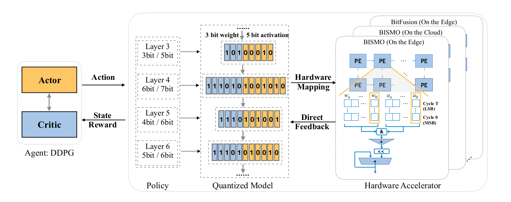

# HAQ-MobileNetV3-Classify

本仓库提供基于 PyTorch 的 HAQ 量化与微调实现，包含 MobileNetV2/MobileNetV3
示例以及 DTD 数据集的使用方式。主要内容包括：



- 预训练与微调脚本
- 基于 DDPG 的混合精度策略搜索
- K-means 权重量化与线性混合精度量化
- 基于查表的延迟成本模型

## 目录结构

- `scripts/pretrain.py`: 全精度模型训练
- `scripts/rl_quantize.py`: RL 搜索量化策略
- `scripts/finetune.py`: 固定策略下的量化微调
- `lib/env/quantize_env.py`: K-means 量化环境
- `lib/env/linear_quantize_env.py`: 线性混合精度环境
- `lib/rl/*`: DDPG 与回放缓冲
- `lib/utils/*`: 数据加载、量化工具、模型剖析
- `models/*`: MobileNet/MobileNetV2/MobileNetV3 定义
- `run/*.sh`: 常见流程脚本示例
- `run/dtd/*.sh`: DTD 数据集的示例脚本（MobileNetV3）
- `docs/`: 参考论文与说明材料

## 依赖

见 `requirements.txt`。

## 数据集准备（DTD 示例）

原始 DTD 数据目录结构：

```
data/dtd/images/<class_name>/*.jpg
```

执行切分脚本：

```
python lib/utils/make_data.py
```

生成如下结构：

```
data/DTD/train/<class_name>/*.jpg
data/DTD/val/<class_name>/*.jpg
```

## 预训练权重（可选）

下载 MobileNetV3 权重：

```
bash run/setup.sh
```

该脚本会安装依赖、创建目录并下载 `mobilenetv3small-f3be529c.pth`

## 总体流程

主要有两类量化流程：

1) K-means 权重量化（侧重模型大小）
2) 线性混合精度量化（侧重延迟）

两者都使用 `scripts/rl_quantize.py` 搜索策略，随后在 `scripts/finetune.py` 中应用策略并微调

## 流程 A：K-means 权重量化（模型大小）

### 1. 搜索策略

```
bash run/run_kmeans_quantize_search.sh
```

使用 `QuantizeEnv` 执行搜索，输出每层权重的 bit 策略。

### 2. 应用策略并微调

在 `scripts/finetune.py` 中的
`if args.arch.startswith('resnet50'):` 分支填入策略（或自行添加分支）

然后执行：

```
bash run/run_kmeans_quantize_finetune.sh
```

### 3. 评估

```
bash run/run_kmeans_quantize_eval.sh
```

## 流程 B：线性混合精度（延迟）

该流程使用 `LinearQuantizeEnv` 和查表延迟模型

### 1. 搜索策略

```
bash run/run_linear_quantize_search.sh
```

查表文件在：

```
lib/simulator/lookup_tables/
```

### 2. 应用策略并微调

在 `scripts/finetune.py` 的 `if args.linear_quantization:` 分支更新策略
（当前仅给出 `qmobilenetv2` 示例）

然后执行：

```
bash run/run_linear_quantize_finetune.sh
```

### 3. 评估

```
bash run/run_linear_quantize_eval.sh
```

## 关键参数说明

`scripts/rl_quantize.py` 常用参数：

- `--arch`: 模型名称（见 `models/__init__.py`）
- `--dataset` / `--dataset_root`: 数据集与路径
- `--preserve_ratio`: 目标压缩比例
- `--min_bit` / `--max_bit`: bit 范围
- `--linear_quantization`: 开启线性混合精度搜索
- `--train_size` / `--val_size`: 搜索阶段子集大小

`scripts/finetune.py` 常用参数：

- `--linear_quantization`: 启用 QConv2d/QLinear 混合精度
- `--pretrained`: 使用预训练权重（见 `models/*`）

## 备注与注意事项

- `run/setup.sh` 会使用 `wget`，需要网络访问
- DTD 示例脚本位于 `run/dtd/`
- `linear_quantize_env.py` 依赖查表文件；更换模型或硬件时需替换表
- `scripts/finetune.py` 需要手动粘贴 RL 搜索得到的策略

## 示例结果（原项目记录）

| Models                   | preserve ratio | Top1 Acc (%) | Top5 Acc (%) |
| ------------------------ | -------------- | ------------ | ------------ |
| resnet50 (original)      | 1.0            | 76.15        | 92.87        |
| resnet50 (10x compress)  | 0.1            | 75.48        | 92.42        |

| Models                     | preserve ratio | Top1 Acc (%) | Top5 Acc (%) |
| -------------------------- | -------------- | ------------ | ------------ |
| mobilenetv2 (original)     | 1.0            | 72.05        | 90.49        |
| mobilenetv2 (0.6x latency) | 0.6            | 71.23        | 90.00        |

## 许可证

MIT，见 `LICENSE`。
